<div align="center">

<!-- 打字机动画：本地 SVG，无需外部服务，永不裂图 -->


### AI Product Manager · Building AI-native Products
> 用产品思维打磨 AI 体验 | AI Eval · Prompt Eng · Agent Workflow

<br>

[](https://jths.info)
[](https://xhslink.com/m/AtEGd4scL9d)
[](mailto:tenghuijin@163.com)


</div>

---

## 🧠 About Me

```python
class AIProductManager:
    name     = "金腾辉 (Tenghui Jin)"
    alias    = "Debra"
    role     = "AI Product Manager @ AI Startup (校招提前批)"
    focus    = ["AI 生成网站", "Openclaw 产品化", "LLM Evaluation"]

    skills   = {
        "Product"  : ["PRD 设计", "用户研究", "竞品分析", "数据驱动决策"],
        "AI/ML"    : ["Prompt Eng", "Content Eng", "Harness 工程", "Lora Fine-tune"],
        "Workflow" : ["Agent Workflow", "Vibe Coding", "AI 评测体系"],
    }

    fun_fact = "用 AI 工具提效团队，也用 AI 陪自己练钢琴 🎹"

    def say_hi(self):
        print("欢迎来到我的 GitHub！一起用产品思维打磨 AI 体验 🚀")
```

---

## ⚡ 技能标签


---

## 🔭 现在在做什么

<table>
<tr>
<td width="50%" valign="top">

### 📊 效果优化
- 搭建 **300+** 评测集 & Trace SOP
- 推进 **7 大**优化专项落地
- 美观度优化 · 多轮编辑优化

</td>
<td width="50%" valign="top">

### 🎨 功能设计
- 主导 **AI 生成网站**全模块设计
- **Openclaw** IM / 定时任务 / Memory 模块
- AI 生成 PPT · AI 语音 · AI 渲染地图

</td>
</tr>
</table>

---

## 🎸 下班之后

| 爱好 | 状态 | 目标 |
|------|------|------|
| 🎹 钢琴 | 初学中 | 弹完 Wedding Dream |
| 🏊 游泳 | 持续进行中 | 保持体能 |
| 🥾 徒步 | 周末限定 | 探索更多山野 |
| 💻 Vibe Coding | 随时随地 | 做 4 个有用的小工具 |
| 📕 小红书创作 | 活跃更新 | 44.1K 赞藏 → 更多 |

---

<div align="center">

**"用产品思维打磨 AI 体验，用 AI 工具放大产品价值"**

<picture>
  <source media="(prefers-color-scheme: dark)" srcset="https://raw.githubusercontent.com/Debra2559/Debra2559/output/github-contribution-grid-snake-dark.svg" />
  <source media="(prefers-color-scheme: light)" srcset="https://raw.githubusercontent.com/Debra2559/Debra2559/output/github-contribution-grid-snake.svg" />
  
</picture>

</div>
